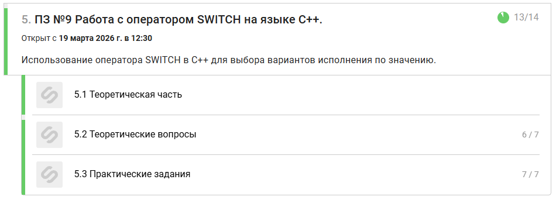

# Prakticheskoe_zadanie_9


--------------------------------------------------------------------------------------------------------------------

## Zadanie 1
```
#include <iostream>
using namespace std;

int main() {
    setlocale(LC_ALL, "Russian");

    int n;
    cin >> n;

    switch (n)
    {
    case 1: cout << "Один"; break;
    case 2: cout << "Два"; break;
    case 3: cout << "Три"; break;
    
    default: cout << "Ошибка";
    }
    

    return 0;
}
```

--------------------------------------------------------------------------------------------------------------------

## Zadanie 2
```
#include <iostream>
using namespace std;

int main() {
    setlocale(LC_ALL, "Russian");

    int n;
    cin >> n;

    switch (n)
    {
    case 1: cout << "Понедельник"; break;
    case 2: cout << "Вторник"; break;
    case 3: cout << "Среда"; break;
    case 4: cout << "Четверг"; break;
    case 5: cout << "Пятница"; break;
    case 6: cout << "Суббота"; break;
    case 7: cout << "Воскресенье"; break;

    default: cout << "Неверный день";
    }
    

    return 0;
}
```

--------------------------------------------------------------------------------------------------------------------

## Zadanie 3
```
#include <iostream>
using namespace std;

int main() {
    setlocale(LC_ALL, "Russian");

    int n;
    cin >> n;

    switch (n)
    {
    case 1: cout << "Зима"; break;
    case 2: cout << "Зима"; break;
    case 12: cout << "Зима"; break;
    case 3: cout << "Весна"; break;
    case 4: cout << "Весна"; break;
    case 5: cout << "Весна"; break;
    case 6: cout << "Лето"; break;
    case 7: cout << "Лето"; break;
    case 8: cout << "Лето"; break;
    case 9: cout << "Осень"; break;
    case 10: cout << "Осень"; break;
    case 11: cout << "Осень"; break;

    default: cout << "Ошибка";
    }
    

    return 0;
}
```

--------------------------------------------------------------------------------------------------------------------

## Zadanie 4
```
#include <iostream>
using namespace std;

int main() {
    setlocale(LC_ALL, "Russian");

    char op;
    int a, b;
    
    cin >> op >> a >> b;


    switch(op)
    {
        case '+':
        cout << a + b;
        break;

        case '-':
        cout << a - b;
        break;
        
        case '*':
        cout << a * b;
        break;

        case '/':
        if (b != 0)  
        {
            cout << a / b;
        }
        else
        {
            cout << "Деление на ноль";
                
        }
            break;
        default:
        cout << "Ошибка";
    }

    return 0;
}
```

--------------------------------------------------------------------------------------------------------------------

## Zadanie 5
```
#include <iostream>
using namespace std;

int main() {
    setlocale(LC_ALL, "Russian");

    int n;
    cin >> n;

    switch (n)
    {
        case 1: cout << "Плохо"; break;
        case 2: cout << "Плохо"; break;

        case 3: cout << "Удовлетворительно"; break;

        case 4: cout << "Хорошо"; break;

        case 5: cout << "Отлично"; break;

        default: cout << "Ошибка";
    }


    return 0;
}
```

--------------------------------------------------------------------------------------------------------------------

## Zadanie 6
```
#include <iostream>
using namespace std;

int main() {
    setlocale(LC_ALL, "Russian");

    int n;
    cin >> n;

    switch (n)
    {
        case 1: cout << "Один"; break;
        case 2: cout << "Два"; break;
        case 3: cout << "Три"; break;
        case 4: cout << "Четыре"; break;
        case 5: cout << "Пять"; break;
        case 6: cout << "Шесть"; break;
        case 7: cout << "Семь"; break;
        case 8: cout << "Восемь"; break;
        case 9: cout << "Девять"; break;
        case 0: cout << "Ноль"; break;

        default: cout << "Ошибка";
    }


    return 0;
}
```

--------------------------------------------------------------------------------------------------------------------

## Zadanie 7
```
#include <iostream>
using namespace std;

int main() {
    setlocale(LC_ALL, "Russian");

    char op;
    int a, b;
    
    cin >> a >> b >> op;


    switch(op)
    {
        case '1':
        cout << a + b;
        break;

        case '2':
        cout << a - b;
        break;
        
        case '3':
        cout << a * b;
        break;

        case '4':
        if (b != 0)  
        {
            cout << a / b;
        }
        else
        {
            cout << "Деление на ноль";
                
        }
            break;
        default:
        cout << "Ошибка";
    }

    return 0;
}
```
